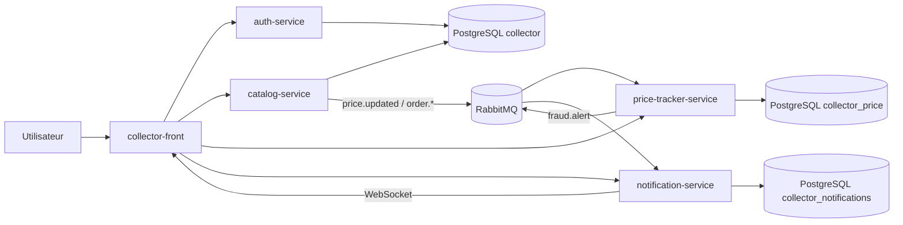
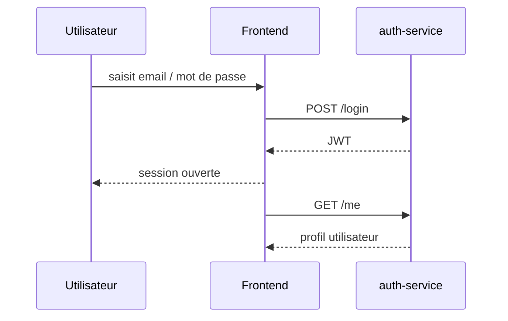
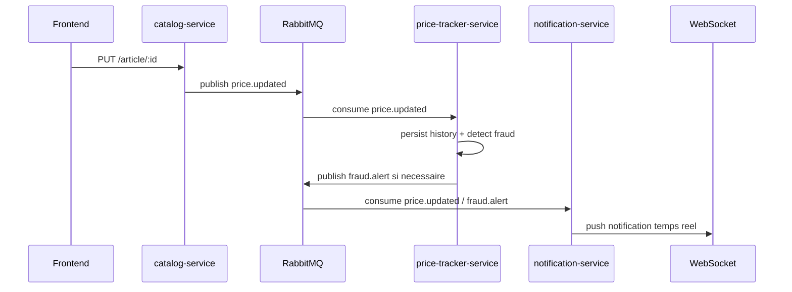
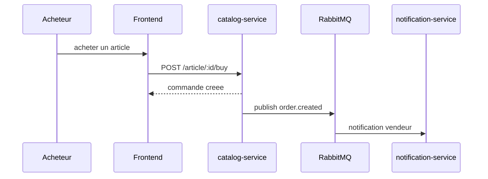
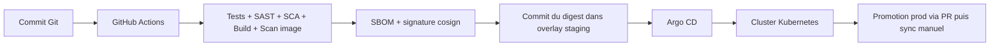

# Dossier Projet - collector.shop

## 1. Objet du document

Ce dossier sert de documentation de reference pour l'ensemble du projet `collector.shop`.
Il explique :

- la finalite produit
- la structure du monorepo
- les composants frontend, backend et infrastructure
- les flux applicatifs et evenementiels
- le fonctionnement local et cible
- la chaine CI/CD, DevSecOps et GitOps
- les points forts, les limites actuelles et les pistes d'evolution

Le depot est organise comme un monorepo avec :

- un frontend `SvelteKit`
- quatre microservices `Go`
- `PostgreSQL` pour la persistance
- `RabbitMQ` pour les evenements
- `Docker Compose` pour l'execution locale
- `Kubernetes + Argo CD + Kyverno` pour la cible GitOps

## 2. Resume executif

`collector.shop` est une plateforme orientee collection qui combine :

- un catalogue d'objets
- des comptes utilisateurs
- des fonctionnalites de marketplace
- de la gamification
- un suivi d'historique de prix
- une detection d'anomalies sur les prix
- des notifications temps reel
- une messagerie entre utilisateurs

Le projet est techniquement structure autour d'une separation claire des responsabilites :

- `auth-service` gere l'identite
- `catalog-service` gere le coeur metier catalogue et marketplace
- `price-tracker-service` historise et analyse les prix
- `notification-service` centralise les notifications et la messagerie temps reel
- `collector-front` fournit l'experience utilisateur unifiee

## 3. Cartographie du depot

```text
collector/
|-- apps/
|   |-- backend/
|   |   |-- auth-service/
|   |   |-- catalog-service/
|   |   |-- price-tracker-service/
|   |   `-- notification-service/
|   |-- collector-front/
|   |-- monitoring/
|   |-- postgres-init/
|   `-- docker-compose.yml
|-- docs/
|-- infra/
|   |-- argocd/
|   |-- k8s/
|   |-- policies/
|   `-- secrets/
|-- .github/workflows/
|-- README.md
|-- ARCHITECTURE.md
|-- PROJECT_OVERVIEW.md
`-- ROADMAP.md
```

## 4. Vision fonctionnelle

### 4.1 Parcours utilisateur couverts

Le projet couvre deja les usages suivants :

- creation de compte et connexion
- consultation du catalogue
- ajout et modification d'articles
- ajout d'images sur les articles
- achat d'un article
- gestion des commandes vendeur / acheteur
- gestion d'une wishlist
- notation et avis vendeur
- consultation de l'historique de prix d'un lot
- reception de notifications temps reel
- consultation d'alertes de fraude
- messagerie entre utilisateurs a propos d'une annonce
- administration de contenus et comptes

### 4.2 Positionnement technique

Le projet n'est pas une application monolithique. Il adopte une architecture microservices event-driven pour isoler les domaines suivants :

- identite
- catalogue / ventes
- suivi des prix
- notifications

Cette approche rend les flux asynchrones explicites et permet de faire evoluer les sous-systemes sans fusionner toutes les responsabilites dans un seul service.

## 5. Architecture globale

### 5.1 Vue systeme



### 5.2 Principes structurants

- un frontend unique consomme plusieurs APIs
- les services REST sont separes par domaine
- les evenements RabbitMQ servent a decoupler les reactions metier
- les donnees sont segmentees par domaine logique
- l'execution locale est conteneurisee
- la cible de deploiement suit un modele GitOps

## 6. Frontend

### 6.1 Stack

- `SvelteKit`
- `TypeScript`
- `Vite`
- `Tailwind CSS`
- `Vitest`

### 6.2 Role

Le frontend centralise l'experience utilisateur. Il ne porte pas la logique metier principale mais orchestre :

- l'authentification
- l'affichage du catalogue
- les ecrans d'administration
- le dashboard
- la vente, le paiement et le profil
- les notifications
- la messagerie

### 6.3 Organisation fonctionnelle

Les routes montrent deux univers principaux :

- `src/routes/(main)` : login, dashboard, admin
- `src/routes/(holo)` : experience utilisateur catalogue / lot / panier / vente / profil / messages

### 6.4 Intefaces backend consommees

- `PUBLIC_AUTH_API_BASE_URL`
- `PUBLIC_CATALOG_API_BASE_URL`
- `PUBLIC_PRICE_TRACKER_API_BASE_URL`
- `PUBLIC_NOTIFICATION_API_BASE_URL`

Le frontend utilise :

- REST pour les operations classiques
- WebSocket pour les notifications et la messagerie temps reel

## 7. Backend

## 7.1 auth-service

### Responsabilite

Gestion de l'identite, des comptes et des jetons JWT.

### Stack

- Go
- Gin
- Gorm
- PostgreSQL

### Endpoints principaux

- `GET /health`
- `POST /utilisateur`
- `POST /login`
- `GET /me`
- `GET /internal/users/:id`
- `GET /admin/users`
- `PATCH /admin/users/:id/suspend`
- `PATCH /admin/users/:id/unsuspend`

### Particularites

- JWT en `HS256`
- limitation de debit sur `login` et `utilisateur`
- endpoint interne protege par `INTERNAL_SECRET`
- espace admin separe

## 7.2 catalog-service

### Responsabilite

Service central metier :

- articles
- categories
- achats
- ventes
- wishlist
- reviews
- moderation / statistiques

### Stack

- Go
- Gin
- Gorm
- PostgreSQL
- RabbitMQ publisher

### Endpoints principaux

- `GET /health`
- `GET /article`
- `GET /article/:id`
- `POST /article`
- `PUT /article/:id`
- `DELETE /article/:id`
- `POST /article/:id/image`
- `GET /me/articles`
- `POST /article/:id/buy`
- `GET /me/orders`
- `GET /me/sales`
- `PATCH /order/:id/accept`
- `PATCH /order/:id/reject`
- `POST /order/:id/review`
- `GET /me/wishlist`
- `POST /me/wishlist`
- `DELETE /me/wishlist/:articleId`
- `GET /admin/stats`
- `GET /admin/articles`
- `POST /category`

### Particularites

- expose les images via `/uploads`
- publie `price.updated` quand un prix change
- publie aussi des evenements de commande
- peut demarrer meme si RabbitMQ est indisponible

## 7.3 price-tracker-service

### Responsabilite

- consommer les mises a jour de prix
- historiser les changements
- detecter des comportements suspects
- publier des alertes de fraude

### Stack

- Go
- Gin
- sqlx
- PostgreSQL
- RabbitMQ consumer / publisher

### Endpoints principaux

- `GET /api/v1/health`
- `GET /api/v1/items/:id/price-history`
- `GET /api/v1/alerts`
- `PUT /api/v1/alerts/:id/resolve`

### Regles actuellement implementees

- `SUSPICIOUS_SPIKE`
- `FLOOD_PRICING`
- `DUMPING`

## 7.4 notification-service

### Responsabilite

- consommer les evenements metier
- persister des notifications
- pousser des evenements au navigateur
- fournir la messagerie entre utilisateurs

### Stack

- Go
- Gin
- sqlx
- PostgreSQL
- Gorilla WebSocket
- RabbitMQ consumer

### Endpoints principaux

- `GET /ws?token=<jwt>`
- `GET /api/v1/health`
- `GET /api/v1/notifications`
- `PUT /api/v1/notifications/:id/read`
- `PUT /api/v1/notifications/read-all`
- `GET /api/v1/notifications/unread-count`
- `POST /api/v1/messages`
- `GET /api/v1/conversations`
- `GET /api/v1/conversations/:id/messages`
- `PUT /api/v1/conversations/:id/read`

### Particularites

- verifie l'origine du WebSocket pour limiter le hijacking
- filtre les donnees sensibles dans la messagerie
- notifie l'emetteur et le destinataire en temps reel
- s'appuie sur `auth-service` pour resoudre certaines informations utilisateur

## 8. Flux applicatifs et evenementiels

### 8.1 Flux de connexion



### 8.2 Flux de mise a jour de prix



### 8.3 Flux d'achat



### 8.4 Flux GitOps



## 9. Donnees et conventions transverses

### 9.1 Bases de donnees

- `collector` pour auth et catalog
- `collector_price` pour le suivi de prix
- `collector_notifications` pour notifications et messages

### 9.2 Mapping d'identifiants

Le catalogue manipule des identifiants entiers `uint`, tandis que les services consommateurs utilisent des `UUID`.
Le projet utilise un mapping deterministe `uint -> UUID` de type :

`00000000-0000-0000-0000-<hex>`

Ce choix permet :

- d'avoir un identifiant compatible entre services
- de conserver une conversion reproductible
- d'exposer des routes `price-tracker` et `notification-service` en UUID

### 9.3 Secrets et variables sensibles

Quelques variables structurantes :

- `JWT_SECRET`
- `INTERNAL_SECRET`
- `RABBITMQ_URL`
- `DATABASE_DSN`
- `FRONTEND_ORIGIN`
- variables `PUBLIC_*` cote frontend

## 10. Execution locale

Le fichier `apps/docker-compose.yml` orchestre :

- `postgres`
- `rabbitmq`
- `mailhog`
- `auth-service`
- `catalog-service`
- `price-tracker`
- `notification-service`
- `collector-front`
- `prometheus`
- `grafana`

### Ports locaux

- frontend : `5173`
- auth : `8080`
- catalog : `8081`
- price-tracker : `8082`
- notification : `8083`
- postgres : `5433` en host
- RabbitMQ UI : `15672`
- Mailhog : `8025`
- Prometheus : `9090`
- Grafana : `3000`

### Lancement

```powershell
cd apps
docker compose up --build
```

## 11. Infrastructure cible

### 11.1 Socle

L'infrastructure cible repose sur :

- `Kustomize`
- `Kubernetes`
- `Argo CD`
- `Sealed Secrets`
- `Kyverno`
- `Argo Rollouts`

### 11.2 Organisation

- `infra/k8s/base` : manifests communs
- `infra/k8s/overlays/staging` : environnement de validation
- `infra/k8s/overlays/prod` : environnement de production
- `infra/argocd/apps` : applications gerees par Argo CD
- `infra/policies` : politiques de securite

### 11.3 Philosophie de deploiement

- la CI ne pousse pas vers le cluster
- la CI modifie uniquement l'etat desire dans Git
- Argo CD applique cet etat dans le cluster
- la production reste protegee par une promotion explicite

## 12. Observabilite

La stack locale inclut :

- `Prometheus`
- `Grafana`
- des endpoints `/metrics` exposes sur des ports internes dedies

Objectifs :

- supervision des services
- suivi du nombre de clients WebSocket
- suivi d'erreurs et d'activite metier

## 13. DevSecOps et CI/CD

### 13.1 Backend

Le pipeline backend enchaine :

- format
- `go vet`
- `golangci-lint`
- `go test -race`
- `gosec`
- `govulncheck`
- `hadolint`
- build image
- scan `Trivy`
- generation de `SBOM`
- signature `cosign`
- mise a jour GitOps des overlays

### 13.2 Frontend

Le pipeline frontend enchaine :

- `eslint`
- `prettier`
- `svelte-check`
- `vitest`
- `Semgrep`
- `Trivy fs`
- build image
- `SBOM`
- `cosign`
- mise a jour GitOps des overlays

### 13.3 Detection de secrets

Un workflow `gitleaks` scanne tous les push et toutes les PR.

## 14. Points de qualite et de securite deja visibles

- separation claire des domaines
- tests unitaires et integration presents sur plusieurs services
- anti brute force sur les endpoints sensibles d'auth
- controle d'origine pour les WebSockets
- filtrage d'informations personnelles dans la messagerie
- scan de dependances et scan d'image
- signatures d'image et SBOM
- politiques Kubernetes de type non-root / ressources / no latest / verification d'images

## 15. Limites actuelles

Les documents et le code montrent plusieurs axes encore ouverts :

- couverture de tests encore partielle
- conventions JSON pas parfaitement homogenes entre services
- roles et permissions encore simples
- un seul frontend pour plusieurs domaines, ce qui peut grossir avec le temps
- certaines fonctionnalites restent orientees demo / POC avance plutot que produit industrialise

## 16. Recommandations d'evolution

### Court terme

- homogeniser toutes les reponses API
- documenter formellement les contrats JSON
- completer les tests de parcours critiques
- ajouter une documentation OpenAPI centralisee

### Moyen terme

- introduire des roles plus fins
- tracer les evenements metier avec correlation id
- clarifier la strategie de stockage des images
- renforcer la gestion des migrations de schema

### Long terme

- etudier une separation plus nette entre catalogue, commandes et messagerie
- introduire une gateway ou un BFF si le frontend continue de grandir
- mettre en place des SLA / SLO et alerting d'exploitation

## 17. Conclusion

`collector.shop` est deja un projet complet, coherent et defendable sur le plan technique.
Il ne s'agit pas seulement d'un CRUD web : le depot contient une architecture microservices, des flux evenementiels, une base DevSecOps solide, une cible GitOps et des fonctionnalites metier transverses reelles.

Le projet est particulierement pertinent pour demonstrer :

- une architecture modulaire
- des integrations asynchrones
- de l'observabilite
- de la securite logicielle
- une chaine de livraison industrialisee

## 18. Livrables associes

Ce dossier est complete par :

- `dossier-projet.html` : version imprimable / exportable en PDF
- `EXPORT_PDF.md` : mode d'emploi d'export
